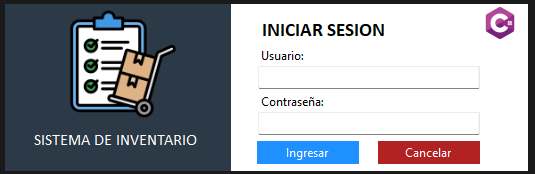
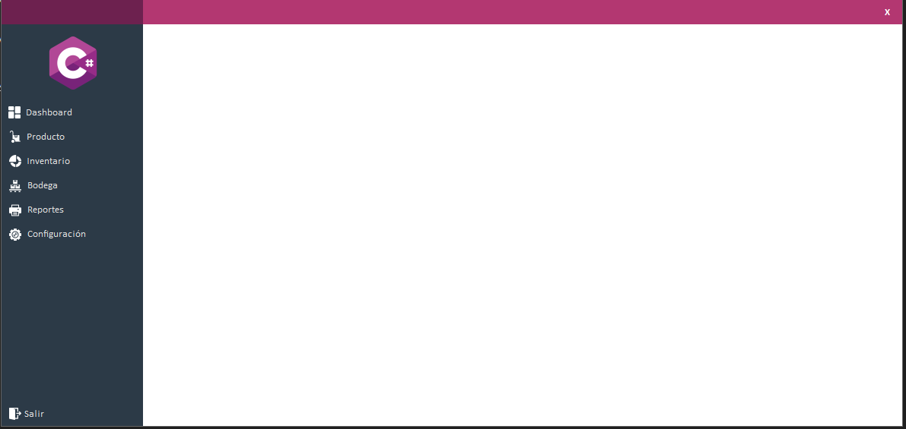
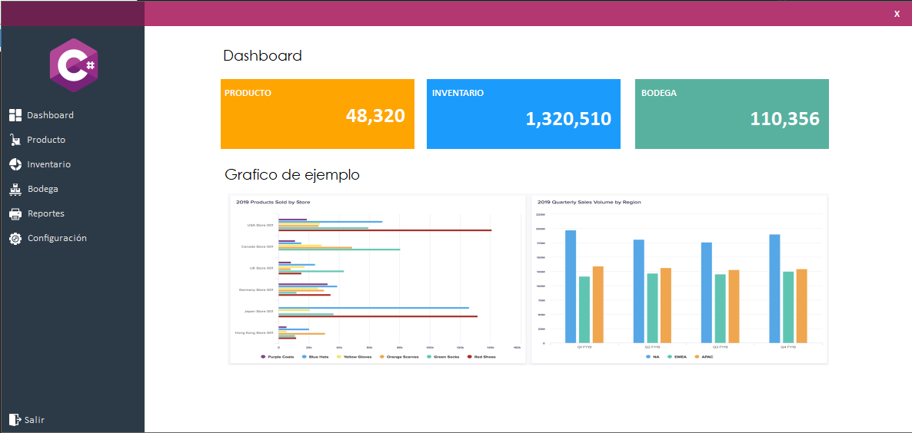

# Flat UI C#
Es una aplicación academica en Winforms realizada en C# con la apariencia Flat-UI desde cero sin dependencia a librerias.

## 🖼️ Interfaz grafica

Hay 3 ventanas disponibles:

**Inicio de sesión**

**Ventana principal**

**Ventana dashboard**

# 📋 Requerimientos
* Net 8
* Visual Studio Community 2022

# 🖌️ Paleta de colores
1. Para la ventana principal:
    - **Panel Lateral Menu** : #2C3A47 [Ships office](https://flatuicolors.com/palette/in)
    - **Panel Lateral Esquina** : #6D214F [Magenta purple](https://flatuicolors.com/palette/in)
	- **Panel Encabezado** :  #B33771 [Fiery Fuchsia](https://flatuicolors.com/palette/in)
1. Para la ventana dashboard:
	- **Panel Producto** : #ffa502 [Orange](https://flatuicolors.com/palette/cn)
	- **Panel Inventario** = #1B9CFC [Clear Chill](https://flatuicolors.com/palette/in)
	- **Panel Bodega** = #58B19F [Keppel](https://flatuicolors.com/palette/in)

# ⭐ Iconos usados
* [Logo](https://www.flaticon.com/free-icon/c-sharp_6132221?term=c&page=1&position=1&origin=search&related_id=6132221)
* [Dashboard](https://www.flaticon.com/free-icon/dashboard_1828765?term=dashboard&page=1&position=1&origin=search&related_id=1828765)
* [Producto](https://www.flaticon.com/free-icon/shipping_3037114?term=product&page=1&position=14)
* [Inventario](https://www.flaticon.com/free-icon/pie-chart_825318?term=chart&page=1&position=63&origin=search&related_id=825318)
* [Bodega](https://www.flaticon.com/free-icon/inventory_14247748?term=inventory&page=2&position=69&origin=search&related_id=14247748)
* [Reportes](https://www.flaticon.com/free-icon/printing_446991?term=printer&page=1&position=4&origin=search&related_id=446991)
* [Configuracion](https://www.flaticon.com/free-icon/technical-support_10700064?term=cog+wheel&page=1&position=33&origin=search&related_id=10700064)
* [Salir](https://www.flaticon.com/free-icon/logout_15566746?term=logout&page=1&position=53&origin=search&related_id=15566746)

# 👱 Author
Ronald Cuello (@ronaldcuello)

# 😍 Creditos
* Gracias a **SirPaya** por la inspiración en el diseño FlatUI.
* [Inventory icons created by Ida Desi Mariana](https://www.flaticon.com/free-icons/inventory)
* [C sharp icons created by Freepik](https://www.flaticon.com/free-icons/c-sharp)
* [Dashboard icons created by Pixel perfect](https://www.flaticon.com/free-icons/dashboard)
* [Product icons created by bqlqn](https://www.flaticon.com/free-icons/product)
* [Pie chart icons created by Freepik](https://www.flaticon.com/free-icons/pie-chart)
* [Ui icons created by Hasymi](https://www.flaticon.com/free-icons/ui)

# 🚔 License
FlatUI is available under the [MIT](./LICENSE.md) license. See the LICENSE file for more info.
